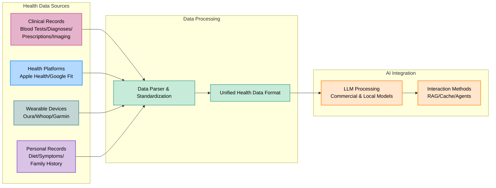

# 🚀 **OpenHealth**

<div align="center">

**AI Health Assistant | Powered by Your Data**

<p align="center">
  
  
  
</p>

> **📢 Now Available on Web!**  
> In response to requests for easier access, we've launched a web version.  
> Try it now: **[open-health.me](https://open-health.me/)**

### 🌍 Choose Your Language
[English](README.md) | [Français](i18n/readme/README.fr.md) | [Deutsch](i18n/readme/README.de.md) | [Español](i18n/readme/README.es.md) | [한국어](i18n/readme/README.ko.md) | [中文](i18n/readme/README.zh.md) | [日本語](i18n/readme/README.ja.md) | [Українська](i18n/readme/README.uk.md) | [Русский](i18n/readme/README.ru.md) | [اردو](i18n/readme/README.ur.md)

</div>

---

<p align="center">
  
</p>

## 🌟 Overview

> OpenHealth helps you **take charge of your health data**. By leveraging AI and your personal health information,
> OpenHealth provides a private assistant that helps you better understand and manage your health. You can run it completely locally for maximum privacy.

## ✨ Project Features

<details open>
<summary><b>Core Features</b></summary>

- 📊 **Centralized Health Data Input:** Easily consolidate all your health data in one place.
- 🛠️ **Smart Parsing:** Automatically parses your health data and generates structured data files.
- 🤝 **Contextual Conversations:** Use the structured data as context for personalized interactions with GPT-powered AI.

</details>

## 📥 Supporting Data Sources & Language Models

<table>
  <tr>
    <th>Data Sources You Can Add</th>
    <th>Supported Language Models</th>
  </tr>
  <tr>
    <td>
      • Blood Test Results<br>
      • Health Checkup Data<br>
      • Personal Physical Information<br>
      • Family History<br>
      • Symptoms
    </td>
    <td>
      • LLaMA<br>
      • DeepSeek-V3<br>
      • GPT<br>
      • Claude<br>
      • Gemini
    </td>
  </tr>
</table>

## 🤔 Why We Built OpenHealth

> - 💡 **Your health is your responsibility.**
> - ✅ True health management combines **your data** + **intelligence**, turning insights into actionable plans.
> - 🧠 AI acts as an unbiased tool to guide and support you in managing your long-term health effectively.

## 🗺️ Project Diagram



> **Note:** The data parsing functionality is currently implemented in a separate Python server and is planned to be migrated to TypeScript in the future.

## Getting Started

## ⚙️ How to Run OpenHealth

<details open>
<summary><b>Installation Instructions</b></summary>

1. **Clone the Repository:**
   ```bash
   git clone https://github.com/OpenHealthForAll/open-health.git
   cd open-health
   ```

2. **Setup and Run:**
   ```bash
   # Copy environment file
   cp .env.example .env

   # Start the application using Docker/Podman Compose
   docker/podman compose --env-file .env up
   ```

   For existing users, use:
   ```bash
   # Generate ENCRYPTION_KEY for .env file:
   # Run the command below and add the output to ENCRYPTION_KEY in .env
   echo $(head -c 32 /dev/urandom | base64)

   # Rebuild and start the application
   docker/podman compose --env-file .env up --build
   ```
   to rebuild the image. Run this also if you make any modifications to the .env file.

3. **Access OpenHealth:**
   Open your browser and navigate to `http://localhost:3000` to begin using OpenHealth.

> **Note:** The system consists of two main components: parsing and LLM. For parsing, you can use docling for full local execution, while the LLM component can run fully locally using Ollama.

> **Note:** If you're using Ollama with Docker, make sure to set the Ollama API endpoint to: `http://docker.for.mac.localhost:11434` on a Mac or `http://host.docker.internal:11434` on Windows.

</details>

---

## Star History

[](https://star-history.com/#OpenHealthForAll/open-health&Date)

---

## 🌐 Community and Support

<div align="center">

### 💫 Share Your Story & Get Updated & Give Feedback
[](https://www.reddit.com/r/AIDoctor/)
[](https://discord.gg/B9K654g4wf)

### 🤝 Talk with Team
[](https://calendly.com/open-health/30min)
[](mailto:sj@open-health.me)

</div>

