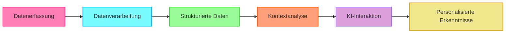

# 🚀 **OpenHealth**

<div align="center">

**KI-Gesundheitsassistent | Betrieben durch Ihre Daten, Lokal Ausgeführt**

</div>

---

<div align="center">

### 🌍 Wählen Sie Ihre Sprache
[English](../../README.md) | [Français](README.fr.md) | [Deutsch](README.de.md) | [Español](README.es.md) | [한국어](README.ko.md) | [中文](README.zh.md) | [日本語](README.ja.md)

</div>

---

## 🌟 Überblick

> OpenHealth hilft Ihnen, **die Kontrolle über Ihre Gesundheitsdaten zu übernehmen**. Durch den Einsatz von KI und Ihren persönlichen Gesundheitsinformationen
> bietet OpenHealth einen privaten und lokal ausgeführten Assistenten, der Ihnen hilft, Ihre Gesundheit besser zu verstehen und zu verwalten.

## ✨ Projektfunktionen

<details open>
<summary><b>Hauptfunktionen</b></summary>

- 📊 **Zentralisierte Gesundheitsdateneingabe:** Konsolidieren Sie alle Ihre Gesundheitsdaten einfach an einem Ort.
- 🛠️ **Intelligentes Parsing:** Analysiert automatisch Ihre Gesundheitsdaten und generiert strukturierte Datendateien.
- 🤝 **Kontextbezogene Gespräche:** Nutzen Sie die strukturierten Daten als Kontext für personalisierte Interaktionen mit GPT-gestützter KI.

</details>

## 📥 Unterstützte Datenquellen & Sprachmodelle

<table>
  <tr>
    <th>Verfügbare Datenquellen</th>
    <th>Unterstützte Sprachmodelle</th>
  </tr>
  <tr>
    <td>
      • Bluttestergebnisse<br>
      • Gesundheitscheck-Daten<br>
      • Persönliche Körperinformationen<br>
      • Familiengeschichte<br>
      • Symptome
    </td>
    <td>
      • LLaMA<br>
      • DeepSeek-V3<br>
      • GPT<br>
      • Claude<br>
      • Gemini
    </td>
  </tr>
</table>

## 🤔 Warum Wir OpenHealth Entwickelt Haben

> - 💡 **Ihre Gesundheit liegt in Ihrer Verantwortung.**
> - ✅ Echtes Gesundheitsmanagement kombiniert **Ihre Daten** + **Intelligenz** und verwandelt Erkenntnisse in umsetzbare Pläne.
> - 🧠 KI fungiert als unvoreingenommenes Werkzeug, um Sie bei der effektiven Verwaltung Ihrer langfristigen Gesundheit zu unterstützen.

## 🗺️ Projektdiagramm



## ⚙️ OpenHealth Ausführen

<details open>
<summary><b>Installationsanweisungen</b></summary>

1. **Repository Klonen:**
   ```bash
   git clone https://github.com/OpenHealthForAll/open-health.git
   cd open-health
   ```

2. **Abhängigkeiten Installieren:**
   ```bash
   npm install
   ```

3. **Anwendung Starten:**
   ```bash
   npm run dev
   ```

4. **Zugriff auf OpenHealth:**
   Öffnen Sie Ihren Browser und navigieren Sie zu `http://localhost:3000`, um OpenHealth zu nutzen.

</details>

---

## 🌐 Community und Support

<div align="center">

[](https://www.reddit.com/user/Dry_Steak30/)

</div> 