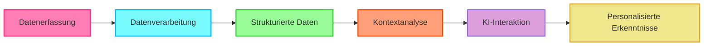

# 🚀 **OpenHealth**

**KI-Gesundheitsassistent | Angetrieben von Ihren Daten**

<p align="center">
  
  
  
</p>

> **📢 Jetzt als Webversion Verfügbar!**  
> Aufgrund Ihrer Anfragen nach einfacherem Zugang haben wir eine Webversion gestartet.  
> Jetzt ausprobieren: **[open-health.me](https://open-health.me/)**

---

<div align="center">

### 🌍 Wählen Sie Ihre Sprache
[English](../../README.md) | [Français](README.fr.md) | [Deutsch](README.de.md) | [Español](README.es.md) | [한국어](README.ko.md) | [中文](README.zh.md) | [日本語](README.ja.md) | [Українська](README.uk.md)

</div>

---

<p align="center">
  
</p>

## 🌟 Überblick

> OpenHealth hilft Ihnen, **die Kontrolle über Ihre Gesundheitsdaten zu übernehmen**. Durch den Einsatz von KI und Ihren persönlichen Gesundheitsinformationen
> bietet OpenHealth einen privaten Assistenten, der Ihnen hilft, Ihre Gesundheit besser zu verstehen und zu verwalten. Für maximale Privatsphäre können Sie es vollständig lokal ausführen.

## ✨ Projektfunktionen

<details open>
<summary><b>Hauptfunktionen</b></summary>

- 📊 **Zentralisierte Gesundheitsdateneingabe:** Konsolidieren Sie alle Ihre Gesundheitsdaten einfach an einem Ort.
- 🛠️ **Intelligentes Parsing:** Analysiert automatisch Ihre Gesundheitsdaten und generiert strukturierte Datendateien.
- 🤝 **Kontextbezogene Gespräche:** Nutzen Sie die strukturierten Daten als Kontext für personalisierte Interaktionen mit GPT-gestützter KI.

</details>

## 📥 Unterstützte Datenquellen & Sprachmodelle

<table>
  <tr>
    <th>Verfügbare Datenquellen</th>
    <th>Unterstützte Sprachmodelle</th>
  </tr>
  <tr>
    <td>
      • Bluttestergebnisse<br>
      • Gesundheitscheck-Daten<br>
      • Persönliche Körperinformationen<br>
      • Familiengeschichte<br>
      • Symptome
    </td>
    <td>
      • LLaMA<br>
      • DeepSeek-V3<br>
      • GPT<br>
      • Claude<br>
      • Gemini
    </td>
  </tr>
</table>

## 🤔 Warum Wir OpenHealth Entwickelt Haben

> - 💡 **Ihre Gesundheit liegt in Ihrer Verantwortung.**
> - ✅ Echtes Gesundheitsmanagement kombiniert **Ihre Daten** + **Intelligenz** und verwandelt Erkenntnisse in umsetzbare Pläne.
> - 🧠 KI fungiert als unvoreingenommenes Werkzeug, um Sie bei der effektiven Verwaltung Ihrer langfristigen Gesundheit zu unterstützen.

## 🗺️ Projektdiagramm



Gesundheitsdaten-Eingabe --> Parsing-Modul --> Strukturierte Datendateien --> GPT-Integration

> **Hinweis:** Die Datenanalyse-Funktionalität ist derzeit in einem separaten Python-Server implementiert und soll in Zukunft zu TypeScript migriert werden.

## ⚙️ OpenHealth ausführen

1. **Repository klonen:**
   ```bash
   git clone https://github.com/OpenHealthForAll/open-health.git
   cd open-health
   ```

2. **Einrichtung und Ausführung:**
   ```bash
   # Umgebungsdatei kopieren
   cp .env.example .env

   # Anwendung mit Docker Compose starten
   docker compose --env-file .env up
   ```

   Für bestehende Benutzer:
   ```bash
   # ENCRYPTION_KEY für die .env-Datei generieren:
   # Führen Sie den folgenden Befehl aus und fügen Sie die Ausgabe zu ENCRYPTION_KEY in .env hinzu
   echo $(head -c 32 /dev/urandom | base64)

   # Bild neu erstellen und starten
   docker compose --env-file .env up --build
   ```

3. **Zugriff auf OpenHealth:**
   Öffnen Sie Ihren Browser und navigieren Sie zu `http://localhost:3000`, um OpenHealth zu nutzen.

> **Hinweis:** Das System besteht aus zwei Hauptkomponenten: Parsing und LLM. Für das Parsing können Sie docling für eine vollständig lokale Ausführung verwenden, während die LLM-Komponente mit Ollama vollständig lokal ausgeführt werden kann.

> **Hinweis:** Wenn Sie Ollama mit Docker verwenden, stellen Sie sicher, dass der Ollama-API-Endpunkt auf `http://docker.for.mac.localhost:11434` für Mac oder `http://host.docker.internal:11434` für Windows eingestellt ist.

## 🌐 Community und Support

<div align="center">

### 💫 Teilen Sie Ihre Geschichte & Bleiben Sie auf dem Laufenden
[](https://www.reddit.com/r/AIDoctor/)
[](https://discord.gg/B9K654g4wf)

### 📬 Kontakt
[](https://www.reddit.com/user/Dry_Steak30/)

### 🤝 Mit dem Team sprechen
[](https://calendly.com/open-health/30min)
[](mailto:sj@open-health.me)

</div>

---
