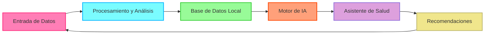

# 🚀 **OpenHealth**

<div align="center">

**Asistente de Salud IA | Impulsado por Sus Datos, Ejecutado Localmente**

</div>

---

<div align="center">

### 🌍 Elija su Idioma
[English](../../README.md) | [Français](README.fr.md) | [Deutsch](README.de.md) | [Español](README.es.md) | [한국어](README.ko.md) | [中文](README.zh.md) | [日本語](README.ja.md)

</div>

---

## 🌟 Descripción General

> OpenHealth le ayuda a **tomar el control de sus datos de salud**. Aprovechando la IA y su información personal de salud,
> OpenHealth proporciona un asistente privado y de ejecución local que le ayuda a comprender y gestionar mejor su salud.

## ✨ Características del Proyecto

<details open>
<summary><b>Funcionalidades Principales</b></summary>

- 📊 **Entrada Centralizada de Datos de Salud:** Consolide fácilmente todos sus datos de salud en un solo lugar.
- 🛠️ **Análisis Inteligente:** Analiza automáticamente sus datos de salud y genera archivos de datos estructurados.
- 🤝 **Conversaciones Contextuales:** Utilice los datos estructurados como contexto para interacciones personalizadas con IA impulsada por GPT.

</details>

## 📥 Fuentes de Datos y Modelos de Lenguaje Compatibles

<table>
  <tr>
    <th>Fuentes de Datos Disponibles</th>
    <th>Modelos de Lenguaje Compatibles</th>
  </tr>
  <tr>
    <td>
      • Resultados de Análisis de Sangre<br>
      • Datos de Chequeo Médico<br>
      • Información Física Personal<br>
      • Historial Familiar<br>
      • Síntomas
    </td>
    <td>
      • LLaMA<br>
      • DeepSeek-V3<br>
      • GPT<br>
      • Claude<br>
      • Gemini
    </td>
  </tr>
</table>

## 🤔 Por Qué Creamos OpenHealth

> - 💡 **Su salud es su responsabilidad.**
> - ✅ La verdadera gestión de la salud combina **sus datos** + **inteligencia**, convirtiendo las percepciones en planes accionables.
> - 🧠 La IA actúa como una herramienta imparcial para guiarlo y apoyarlo en la gestión efectiva de su salud a largo plazo.

## 🗺️ Diagrama del Proyecto



## ⚙️ Cómo Ejecutar OpenHealth

<details open>
<summary><b>Instrucciones de Instalación</b></summary>

1. **Clonar el Repositorio:**
   ```bash
   git clone https://github.com/OpenHealthForAll/open-health.git
   cd open-health
   ```

2. **Instalar Dependencias:**
   ```bash
   npm install
   ```

3. **Iniciar la Aplicación:**
   ```bash
   npm run dev
   ```

4. **Acceder a OpenHealth:**
   Abra su navegador y vaya a `http://localhost:3000` para comenzar a usar OpenHealth.

</details>

---

## 🌐 Comunidad y Soporte

<div align="center">

[](https://www.reddit.com/user/Dry_Steak30/)

</div> 