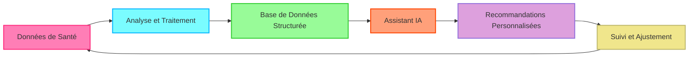

# 🚀 **OpenHealth**

**Assistant de santé IA | Alimenté par vos données**

<div align="center">

**Assistant Santé IA | Alimenté par Vos Données**

<p align="center">
  
  
  
</p>

> **📢 Maintenant Disponible en Version Web !**  
> Suite à vos demandes d'accès simplifié, nous avons lancé une version web.  
> Essayez dès maintenant : **[open-health.me](https://open-health.me/)**

### 🌍 Choisissez votre langue
[English](../../README.md) | [Français](README.fr.md) | [Deutsch](README.de.md) | [Español](README.es.md) | [한국어](README.ko.md) | [中文](README.zh.md) | [日本語](README.ja.md) | [Українська](README.uk.md)

</div>

---

<p align="center">
  
</p>

## 🌟 Aperçu

> OpenHealth vous aide à **prendre en charge vos données de santé**. En exploitant l'IA et vos informations de santé personnelles,
> OpenHealth fournit un assistant privé qui vous aide à mieux comprendre et gérer votre santé. Vous pouvez l'exécuter entièrement en local pour une confidentialité maximale.

## ✨ Caractéristiques du Projet

<details open>
<summary><b>Fonctionnalités Principales</b></summary>

- 📊 **Saisie Centralisée des Données de Santé :** Consolidez facilement toutes vos données de santé en un seul endroit.
- 🛠️ **Analyse Intelligente :** Analyse automatiquement vos données de santé et génère des fichiers de données structurées.
- 🤝 **Conversations Contextuelles :** Utilisez les données structurées comme contexte pour des interactions personnalisées avec l'IA alimentée par GPT.

</details>

## 📥 Sources de Données et Modèles de Langage Pris en Charge

<table>
  <tr>
    <th>Sources de Données Disponibles</th>
    <th>Modèles de Langage Pris en Charge</th>
  </tr>
  <tr>
    <td>
      • Résultats d'Analyses Sanguines<br>
      • Données de Bilan de Santé<br>
      • Informations Physiques Personnelles<br>
      • Antécédents Familiaux<br>
      • Symptômes
    </td>
    <td>
      • LLaMA<br>
      • DeepSeek-V3<br>
      • GPT<br>
      • Claude<br>
      • Gemini
    </td>
  </tr>
</table>

## 🤔 Pourquoi Nous Avons Créé OpenHealth

> - 💡 **Votre santé est votre responsabilité.**
> - ✅ La véritable gestion de la santé combine **vos données** + **l'intelligence**, transformant les insights en plans d'action.
> - 🧠 L'IA agit comme un outil impartial pour vous guider et vous soutenir dans la gestion efficace de votre santé à long terme.

## 🗺️ Diagramme du Projet



Entrée de données de santé --> Module d'analyse --> Fichiers de données structurées --> Intégration GPT

> **Remarque :** La fonctionnalité d'analyse des données est actuellement implémentée dans un serveur Python séparé et sera migrée vers TypeScript à l'avenir.

## Commencer

## ⚙️ Comment exécuter OpenHealth

1. **Cloner le dépôt :**
   ```bash
   git clone https://github.com/OpenHealthForAll/open-health.git
   cd open-health
   ```

2. **Configuration et Exécution:**
   ```bash
   # Copier le fichier d'environnement
   cp .env.example .env

   # Démarrer l'application avec Docker Compose
   docker compose --env-file .env up
   ```

   Pour les utilisateurs existants:
   ```bash
   # Générer la clé ENCRYPTION_KEY pour le fichier .env:
   # Exécutez la commande ci-dessous et ajoutez la sortie à ENCRYPTION_KEY dans .env
   echo $(head -c 32 /dev/urandom | base64)

   # Reconstruire et démarrer l'application
   docker compose --env-file .env up --build
   ```

3. **Accéder à OpenHealth:**
   Ouvrez votre navigateur et accédez à `http://localhost:3000` pour commencer à utiliser OpenHealth.

> **Note:** Le système est composé de deux composants principaux: l'analyse et le LLM. Actuellement, l'analyse utilise les API Upstage et OpenAI (qui ont montré les meilleures performances lors de nos tests), avec un analyseur local à venir prochainement, tandis que le composant LLM peut fonctionner entièrement en local avec Ollama.

> **Note:** Si vous utilisez Ollama avec Docker, assurez-vous de définir le point de terminaison de l'API Ollama sur: `http://docker.for.mac.localhost:11434` pour Mac ou `http://host.docker.internal:11434` pour Windows.

---

## 🌐 Communauté et Support

<div align="center">

### 💫 Partagez Votre Histoire & Restez Informé
[](https://www.reddit.com/r/AIDoctor/)
[](https://discord.gg/B9K654g4wf)

### 📬 Contact
[](https://www.reddit.com/user/Dry_Steak30/)

### 🤝 Parler avec l'Équipe
[](https://calendly.com/open-health/30min)
[](mailto:sj@open-health.me)

</div> 