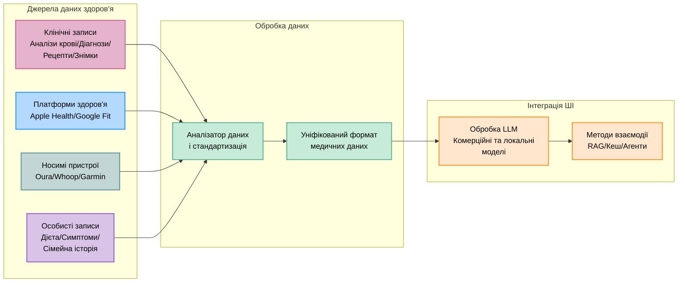

# 🚀 **OpenHealth**

<div align="center">

**AI-асистент здоров'я | Працює на ваших даних**

<p align="center">
  
  
  
</p>

> **📢 Тепер доступно у веб-версії!**  
> У відповідь на запити щодо простішого доступу ми запустили веб-версію.  
> Спробуйте зараз: **[open-health.me](https://open-health.me/)**

### 🌍 Виберіть свою мову
[English](../../README.md) | [Français](README.fr.md) | [Deutsch](README.de.md) | [Español](README.es.md) | [한국어](README.ko.md) | [中文](README.zh.md) | [日本語](README.ja.md) | [Українська](README.uk.md)

</div>

---

<p align="center">
  
</p>

## 🌟 Огляд

> OpenHealth допомагає вам **контролювати дані про своє здоров'я**. Використовуючи ШІ та вашу інформацію про особисте здоров'я,
> OpenHealth надає приватного помічника, який допомагає краще розуміти своє здоров'я та керувати ним. Для максимального захисту конфіденційності ви можете повністю запускати його локально.

## ✨ Можливості проекту

<details open>
<summary><b>Ключові можливості</b></summary>

- 📊 **Централізоване введення даних про здоров'я:** Легко об'єднайте всі дані про здоров'я в одному місці.
- 🛠️ **Розумний аналіз:** автоматично аналізує ваші дані про здоров'я та створює файли структурованих даних.
- 🤝 **Контекстуальні бесіди:** Використовуйте структуровані дані як контекст для персоналізованої взаємодії з AI на основі GPT.

</details>

## 📥 Підтримка джерел даних і мовних моделей

<table>
  <tr>
    <th>Джерела даних, які можна додати</th>
    <th>Підтримувані мовні моделі</th>
  </tr>
  <tr>
    <td>
      • Результати аналізу крові<br>
      • Дані перевірки стану здоров'я<br>
      • Особиста фізична інформація<br>
      • Сімейна історія<br>
      • Симптоми
    </td>
    <td>
      • LLaMA<br>
      • DeepSeek-V3<br>
      • GPT<br>
      • Claude<br>
      • Gemini
    </td>
  </tr>
</table>

## 🤔 Чому ми створили OpenHealth

> - 💡 **Ваше здоров'я - ваша відповідальність.**
> - ✅ Справжнє управління здоров'ям поєднує **ваші дані** + **інтелект**, перетворюючи розуміння на дієві плани.
> - 🧠 ШІ діє як неупереджений інструмент, який допомагає вам ефективно керувати своїм довгостроковим здоров'ям.

## 🗺️ Діаграма проекту



> **Примітка.** Функціональність синтаксичного аналізу даних наразі реалізована на окремому сервері Python, а в майбутньому її планується перенести на TypeScript.

## Початок роботи

## ⚙️ Як запустити OpenHealth

<details open>
<summary><b>Інструкції з монтажу</b></summary>

1. **Клонуйте репозиторій:**
   ```bash
   git clone https://github.com/OpenHealthForAll/open-health.git
   cd open-health
   ```

2. **Налаштувати та запустити:**
   ```bash
   # Скопіюйте файл середовища
   cp .env.example .env

   # Запустіть програму за допомогою Docker Compose
   docker compose --env-file .env up
   ```

   Для існуючих користувачів використовуйте:
   ```bash
   # Згенеруйте ENCRYPTION_KEY для файлу .env:
   # Виконайте команду нижче та додайте вивід до ENCRYPTION_KEY у .env
   echo $(head -c 32 /dev/urandom | base64)

   # Перебудувати та запустити програму
   docker compose --env-file .env up --build
   ```

3. **Доступ до OpenHealth:**
   Відкрийте браузер і перейдіть до `http://localhost:3000`, щоб почати використовувати OpenHealth.

> **Примітка.** Система складається з двох основних компонентів: аналізу та LLM. Для аналізу ви можете використовувати docling для повного локального виконання, а компонент LLM може працювати повністю локально за допомогою Ollama.

> **Примітка.** Якщо ви використовуєте Ollama з Docker, обов'язково встановіть кінцеву точку Ollama API на: `http://docker.for.mac.localhost:11434` для Mac або `http://host.docker.internal:11434` для Windows.

</details>

---

## 🌐 Спільнота та Підтримка

<div align="center">

### 💫 Поділіться Своєю Історією та Отримуйте Оновлення
[](https://www.reddit.com/r/AIDoctor/)
[](https://discord.gg/B9K654g4wf)

### 📬 Контакти
[](https://www.reddit.com/user/Dry_Steak30/)

### 🤝 Поговорити з Командою
[](https://calendly.com/open-health/30min)
[](mailto:sj@open-health.me)

</div>

